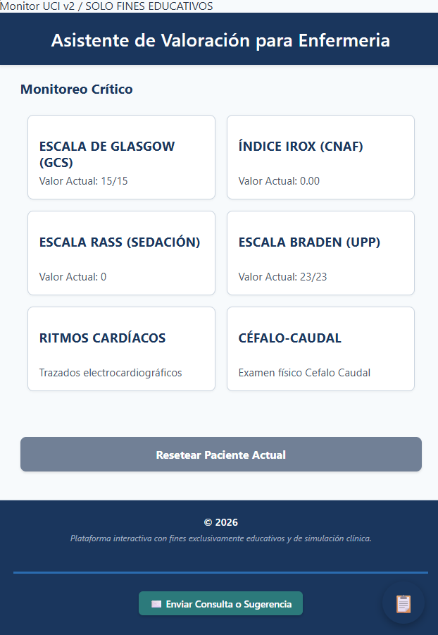

#  Monitor UCI - Simulador de Escalas y Parámetros Clínicos Interactivos

Plataforma interactiva diseñada para el personal de enfermería y profesionales de la salud en unidades de cuidados críticos y servicios de emergencias. La herramienta centraliza y automatiza el cálculo de escalas fundamentales, guías de examen físico y simulación de ritmos en vivo, optimizando los tiempos de aprendizaje, simulación y capacitación profesional.

> ** AVISO IMPORTANTE:** Este software ha sido desarrollado exclusivamente con **FINES EDUCATIVOS**, académicos y de simulación para capacitación profesional. No debe ser utilizado como reemplazo del criterio clínico real en la toma de decisiones médicas o asistencia al paciente.

---

##  Demo en Vivo y Vista Previa

### Demostración Interactiva (GIF)
*(Flujo trabajo de la aplicación: apertura de escala de Glasgow con cálculo dinámico, activación de alertas visuales críticas y el monitor de ECG interactivo en funcionamiento).*


###  Dashboard de la Aplicación


---

##  Acceso Directo al Proyecto

La plataforma está desplegada de forma pública y optimizada para su uso inmediato tanto en computadoras de escritorio como en teléfonos móviles:

 **[Ver Monitor Online en GitHub Pages](https://p-glinka.github.io/monitor-uci/)**

---

##  Módulos Clínicos Integrados

El panel centraliza las herramientas y valoraciones más utilizadas en el día a día de una Unidad de Terapia Intensiva (UTI) y salas de internación general:

1. **Monitor de Ritmos Cardíacos (ECG):** Simulador interactivo en tiempo real con trazado electrocardiográfico dinámico. Permite conmutar entre Ritmo Sinusal Normal, Bradicardia, Taquicardia, Flutter Atrial, Fibrilación Atrial, TSV, TV, Torsades de Pointes, Fibrilación Ventricular y Asistolia, mostrando la frecuencia cardíaca (FC) y su correspondiente descripción clínica.
2. **Valoración Enfermera Céfalo-Caudal:** Guía interactiva estructurada por sistemas (Neurológico, Cardiovascular, Respiratorio, Gastrointestinal, Renal/Genitourinario y Tegumentario) para estandarizar el examen físico sistemático del paciente crítico.
3. **Escala de Glasgow (GCS):** Evaluación neurológica del nivel de conciencia analizando la respuesta ocular, verbal y motora, incorporando un sistema automático de alertas visuales (Crítico, Moderado, Leve).
4. **Escala RASS (Richmond Agitation-Sedation Scale):** Monitoreo del nivel de sedación y agitación para pacientes críticos o bajo Asistencia Respiratoria Mesa (ARM).
5. **Escala de Braden:** Evaluación predictiva del riesgo de desarrollar Úlceras por Presión (UPP) analizando percepción sensorial, humedad, actividad, movilidad, nutrición y fricción.
6. **Índice IROX:** Herramienta matemática de predicción de éxito o fracaso en la Oxigenoterapia de Alto Flujo (CNAF) cruzando datos de saturación (SatO2), FiO2 y frecuencia respiratoria.

---

## Stack Tecnológico

El simulador fue construido priorizando la velocidad de carga, la independencia de servidores externos y un rendimiento óptimo en entornos móviles de baja conectividad:

   **HTML5 Semántico:** Estructuración sólida de las vistas clínicas, formularios de puntuación y accesibilidad.
   **CSS3 Moderno:** Maquetación responsiva basada en `CSS Grid` y `Flexbox` para emular un monitor multiparamétrico real. Uso de variables globales para una gestión ágil de la paleta de colores institucional.
   **JavaScript Vanilla (ES6+):** Lógica del negocio pura, reactividad inmediata ante las entradas del usuario y cálculo algorítmico de los scores clínicos sin sobrecargar el navegador.
   **Canvas API:** Renderizado gráfico y animación matemática en tiempo real del vector electrocardiográfico continuo del ECG a 60 FPS.
   **Web Storage (LocalStorage):** Persistencia de datos local para mantener el estado de las últimas evaluaciones del paciente, previniendo pérdidas de información ante cierres accidentales.

---

## Arquitectura de Software y Flujo de Datos

La aplicación sigue un flujo de diseño modular y unidireccional que asegura la separación de responsabilidades y facilita el mantenimiento técnico del código:

```text
       [ main.js ] (Orquestador principal y enrutador de vistas)
           │
           ▼
     [ Módulos Clínicos ]
    ┌──────┬──────┬──────┬──────┬──────┐
    │      │      │      │      │      │
 [Glasgow] [RASS] [Braden] [IROX] [ECG] [Céfalo-Caudal]
    │      │      │      │      │      │
    └──────┴──────┴──────┴──────┴──────┘
           │
           ▼
     [ Utilidades ] (Cálculos matemáticos, validadores y Web Storage)
           │
           ▼
 [ Configuración Clínica ] (Constantes médicas, diccionarios de ritmos y alertas)

```Roadmap de Desarrollo (Hacia un Sistema Integral)
El proyecto nació como una herramienta estática y avanza firmemente hacia una plataforma robusta de gestión e información de salud.

[x] MVP (Producto Mínimo Viable): Automatización de las 4 escalas clínicas iniciales.

[x] Monitor ECG: Implementación del Canvas interactivo con trazados dinámicos.

[x] Persistencia Local: Almacenamiento local del estado actual de las evaluaciones (LocalStorage).

[ ] Módulo de Usuarios: Sistema de autenticación seguro para personal de enfermería.

[ ] Dashboard Avanzado: Panel estadístico con el histórico y evolución temporal de cada paciente.

[ ] Persistencia en Servidor: Migración de datos locales a una Base de Datos Relacional (PostgreSQL).

[ ] Reportes Clínicos: Módulo de exportación de valoraciones en formato PDF para firmas físicas o archivos.

[ ] Historia Clínica Digital: Integración de un registro de enfermería evolutivo continuo.

[ ] API REST: Interfaz de programación para comunicar el monitor con otros sistemas hospitalarios públicos.
